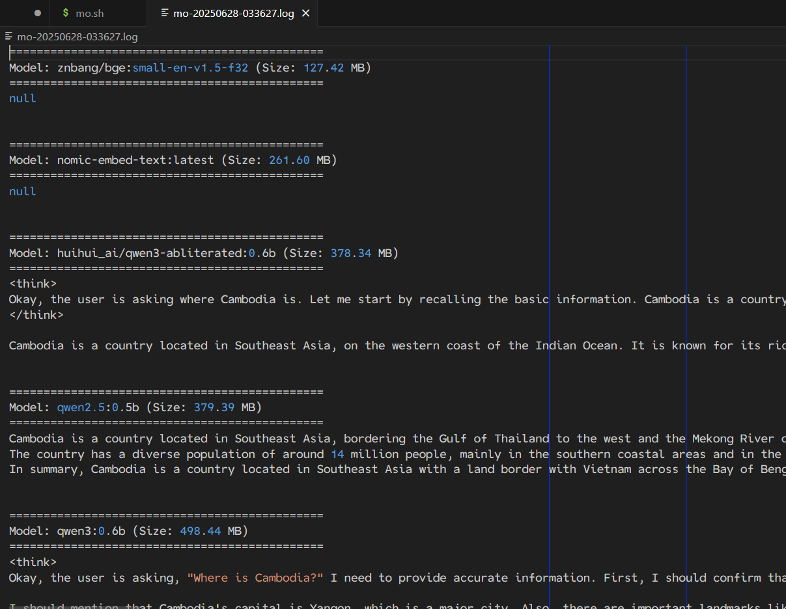

# mo.sh

`mo.sh` is a simple, powerful Bash script to query **all locally available Ollama models** sequentially with the **same prompt**, collecting their responses into a single timestamped log file.

</img>
---

## Features

- Automatically fetches all Ollama models on your local machine via Ollama’s REST API.
- Sorts models by size (smallest to largest).
- Sends a user-provided prompt to each model without streaming.
- Aggregates outputs into one timestamped log file with clear model headers.
- Shows progress and sizes in human-readable MB on the console.
- Easy to customize for any prompt.

---

## Requirements

- Ollama CLI & server running locally (default API at `http://localhost:11434`).
- `curl`
- `jq`
- Bash (tested on Linux/macOS)

---

## Usage

```bash
chmod +x mo.sh
./mo.sh "Your prompt here"
```

## Output
</img>
```log
==============================================
Model: znbang/bge:small-en-v1.5-f32 (Size: 127.42 MB)
==============================================
null


==============================================
Model: nomic-embed-text:latest (Size: 261.60 MB)
==============================================
null


==============================================
Model: huihui_ai/qwen3-abliterated:0.6b (Size: 378.34 MB)
==============================================
<think>
Okay, the user is asking where Cambodia is. Let me start by recalling the basic information. Cambodia is a country in Southeast Asia, located on the western coast of the Indian Ocean. It's known for its rich culture, diverse population, and historical significance. I should mention its geographical position, the main islands, and the main city. Also, include some key points like its economic status, political system, and how it's perceived in the international community. Make sure to keep the answer clear and concise, using correct terminology.
</think>

Cambodia is a country located in Southeast Asia, on the western coast of the Indian Ocean. It is known for its rich culture, diverse population, and historical significance. The country lies between the Indian and Pacific Oceans, with its main islands, including the island of Cambodia itself. It is a significant part of the ASEAN (Association of Southeast Asian Nations) and is a major economic and political center in the region. The capital of Cambodia is Phnom Bai, and the country is often highlighted in discussions about regional politics and geography. Its status as a stable and well-developed country in the region makes it an important part of global discussions on regional stability and development.


==============================================
Model: qwen2.5:0.5b (Size: 379.39 MB)
==============================================
Cambodia is a country located in Southeast Asia, bordering the Gulf of Thailand to the west and the Mekong River on its east coast. It also shares a land border with Vietnam across the Bay of Bengal. The capital city is Phnom Penh. Cambodia's official language is Khmer, and it uses the Cambodian numeral system.
The country has a diverse population of around 14 million people, mainly in the southern coastal areas and in the central lowlands. Most of its residents are ethnic minorities such as the Lao, Mon, Bamar, Burmese, and Thai. Cambodia is a member of the United Nations, but it does not have an internationally recognized national anthem or flag.
In summary, Cambodia is a country located in Southeast Asia with a land border with Vietnam across the Bay of Bengal. It has a diverse population of around 14 million people and uses the Cambodian numeral system as its official language.


==============================================
Model: qwen3:0.6b (Size: 498.44 MB)
==============================================
<think>
Okay, the user is asking, "Where is Cambodia?" I need to provide accurate information. First, I should confirm that Cambodia is a country located in Southeast Asia. Let me recall the key points. It's a member of the ASEAN (Association of Southeast Asian Nations), has a coastline along the Mekong River, and is known for its rich culture and vibrant markets.

I should mention that Cambodia's capital is Yangon, which is a major city. Also, there are important landmarks like the Grand Palace and the Khao Sam Riffa Temple. It's important to note the political status as a member of ASEAN. I should avoid any inaccuracies and ensure the information is up-to-date. Let me check if there's any recent changes, but I think the basic facts are correct. Finally, make sure the answer is clear and concise.
</think>

Cambodia is a country located in Southeast Asia, bordered by Thailand to the north and Myanmar to the south. It is part of the ASEAN (Association of Southeast Asian Nations) and is known for its rich cultural heritage, vibrant markets, and significant historical landmarks such as the Grand Palace in Yangon. As a member of ASEAN, Cambodia has played an important role in regional affairs and is a key player in the region's economic and political dynamics.


==============================================
Model: mxbai-embed-large:latest (Size: 638.60 MB)
==============================================
null


==============================================
Model: qwen2.5-coder:1.5b-base (Size: 940.38 MB)
==============================================
 Can you tell me about the capital city?
Kyiv
Vientiane
Phnom Penh
Hanoi
Answer: Phnom Penh

Which of these sentences has a subject-verb agreement error?
A. The boy wrote an essay and got an A.
B. We know that he can do math.
C. The man gave the money to the dog.
D. They went into the park.
Answer: D

Which of the following sentences is correct in terms of sentence structure?
A. I have a lot of problems, so my father always tries his best to help me out.
B. He should be able to do it right now if he had done it yesterday.
C. In order to better meet people's needs, we are constantly improving our services.
D. He is one of those people who has been involved in many conflicts over the years.
Answer: B

Which of the following sentences uses an idiom incorrectly?
A. Some people think that China has a long history; it was born with a thousand-year-long golden age.
B. In the world, no country can compare to China in terms of its unique culture and civilization.
C. The students who studied diligently were not only good at memorizing facts but also capable of grasping concepts.
D. We have all heard that China's achievements are dazzling; it was like a brilliant star appearing at night.
Answer: A

Which of the following sentences has an idiom used incorrectly?
A. For the new teachers, they can be called as their first aid kit for handling various situations; they should be well-prepared and have a heart full of love.
B. The company's performance evaluation system is so thorough and comprehensive that it is not easily subject to criticism or adjustment.
C. If you do nothing wrong in life, there will surely be others who are far better than you.
D. When the old man went down to the well with his bucket, he was extremely tired; everyone in the village said: "You must be exhausted!"
Answer: C

Which of the following sentences uses an idiom incorrectly?
A. When I first saw that book cover, it was like a bolt from the blue, catching my eye and making me take a step back.
B. He is a person with an unshakable determination to improve himself; he has no hesitation in his resolve to make up for mistakes he may have made.
C. In his diary entry on July 28th, one of them wrote: "I can't wait to go out and play the game again."
D. This movie is just an ordinary story about love and loss, which leaves you thinking long after the scene has ended.
Answer: B

Which of the following sentences is grammatically correct?
A. The development of science and technology, especially information technology, has become a major factor in the competition for economic development between countries around the world.
B. Whether it's the rapid increase or decline of national GDP, the core reason lies in whether it can effectively promote and maintain social harmony with stability.
C. According to statistics, the main cause of accidents is human error; when it comes to the causes of errors, there are no major ones like that.
D. He has been a leader in China's modern history for decades. When he was young, he worked diligently in his field; now, as a professor, he continues to work with great enthusiasm.
Answer: D

Which of the following sentences uses an idiom correctly?
A. After the meeting between the two countries, there was no one present but the two parties themselves.
B. He's like your father; if you go to another province, he can accompany you.
C. The movie has not been well received by many viewers due to some unclear plot twists and unexpected outcomes.
D. This beautiful spring garden is absolutely stunning.
Answer: D


==============================================
Model: socialnetwooky/llama3.2-abliterated:1b_q8 (Size: 1259.88 MB)
==============================================
Cambodia is a small country located in Southeast Asia. It is bordered by Thailand to the west, Laos to the north, Vietnam to the east and south, and the Gulf of Thailand to the southwest.


==============================================
Model: llama3.2:1b (Size: 1259.90 MB)
==============================================
Cambodia is a country located in Southeast Asia. It is situated on the Irrawaddy River and borders several countries, including Thailand to the southeast, Laos to the northeast, Vietnam to the east, and Myanmar (Burma) to the west.

Specifically, Cambodia is an island nation, with most of its landmass being surrounded by water. The country's coastline stretches for approximately 360 kilometers (224 miles), with the Gulf of Thailand on the southwest coast and the Gulf of Thailand (also known as the South China Sea) on the northwestern coast.

Cambodia shares borders with three countries: Laos to the northeast, Vietnam to the east, and Myanmar (Burma) to the west.


==============================================
Model: qwen3:1.7b (Size: 1296.32 MB)
==============================================
<think>
Okay, the user is asking where Cambodia is. I need to provide a clear and concise answer. Let me start by recalling the basic geography of Cambodia.

First, I know that Cambodia is a country in Southeast Asia. It's located in the region that includes countries like Vietnam, Thailand, and Laos. The country is bordered by Vietnam to the northwest, Thailand to the south, and the South China Sea to the east. It also has a border with Laos to the northwest.

I should mention the capital city, Phnom Penh, which is in the central part of the country. The country is known for its historical sites like Angkor Wat, which is in the southern part. The terrain is mostly mountainous, with the central region being more flat. There are also some plains in the north and east.

I should also note the climate, mentioning that it's tropical and humid, with two main seasons: the dry season from May to October and the monsoon season from November to April. The country has a mix of ethnic groups, including the Khmer people, who are the majority, and others like the Vietnamese, H'Mong, and Lao.

Wait, the user might be looking for a simple answer without too much detail. Let me structure it: location, borders, capital, notable landmarks, and climate. Make sure to keep it straightforward. Also, check if there's any recent changes or facts I need to include, but I think the basic info is sufficient.
</think>

Cambodia is a country in Southeast Asia, located in the heart of the region. It shares borders with **Vietnam** to the northwest, **Thailand** to the south, and the **South China Sea** to the east. The capital city, **Phnom Penh**, is situated in the central part of the country. 

Geographically, Cambodia is known for its **mountainous terrain**, with the **central region** being relatively flat. It has a **tropical climate**, experiencing two main seasons: the **dry season** from May to October and the **monsoon season** from November to April. 

Notable landmarks include the **Angkor Wat** complex in the southern region and the **Khmer Rouge Memorial** in the north. Cambodia is also home to a diverse population, including the **Khmer people**, **Vietnamese**, **H'Mong**, and **Lao** communities.
```
